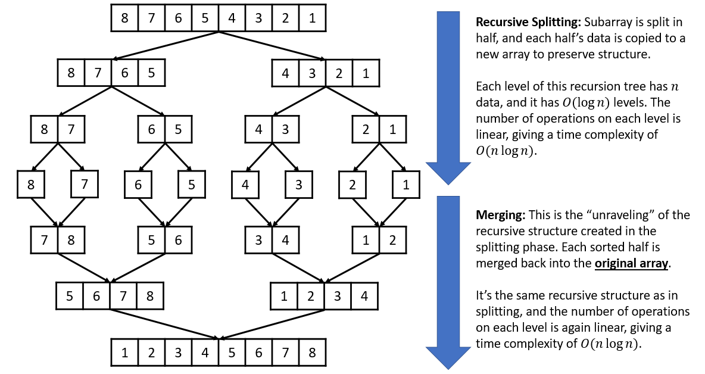

# Divide and conquer sorts

## Merge sort

### Core idea


Time: O(n log n)
Space: O(n)

### Pseudocode
```
mergeSort(array):
    if length(array) <= 1:
        return array

    mid = length(array) / 2
    left  = array[0 : mid]
    right = array[mid : end]

    sorted_left  = mergeSort(left)
    sorted_right = mergeSort(right)

    return merge(sorted_left, sorted_right)

merge(left, right):
    result = empty list
    i = 0
    j = 0

    while i < length(left) AND j < length(right):
        if left[i] <= right[j]:
            append left[i] to result
            i = i + 1
        else:
            append right[j] to result
            j = j + 1

    # append any remaining items
    while i < length(left):
        append left[i] to result
        i = i + 1

    while j < length(right):
        append right[j] to result
        j = j + 1

    return result
    
```

## Quick sort

### Core idea
- Choose a pivot element from the array.

- Partition the array so that:
    - Elements < pivot go to the left
    - Elements > pivot go to the right

- Recursively apply Quick Sort to the left and right subarrays.

Time: O(n log n)
Space: O(log n)

### Pseudocode
```
def quick_sort(arr):
    if len(arr) <= 1:
        return arr
    
    pivot = arr[len(arr) // 2]
    left = [x for x in arr if x < pivot]
    equal = [x for x in arr if x == pivot]
    right = [x for x in arr if x > pivot]

    return quick_sort(left) + equal + quick_sort(right)
```